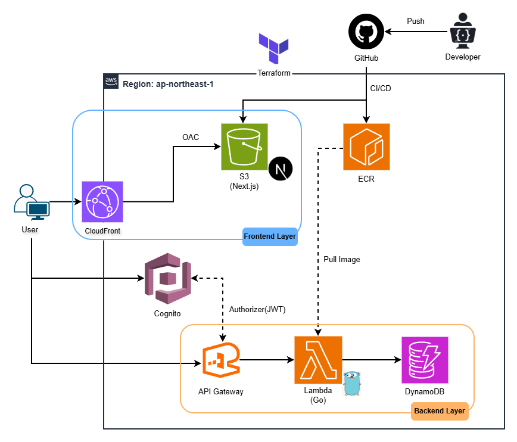
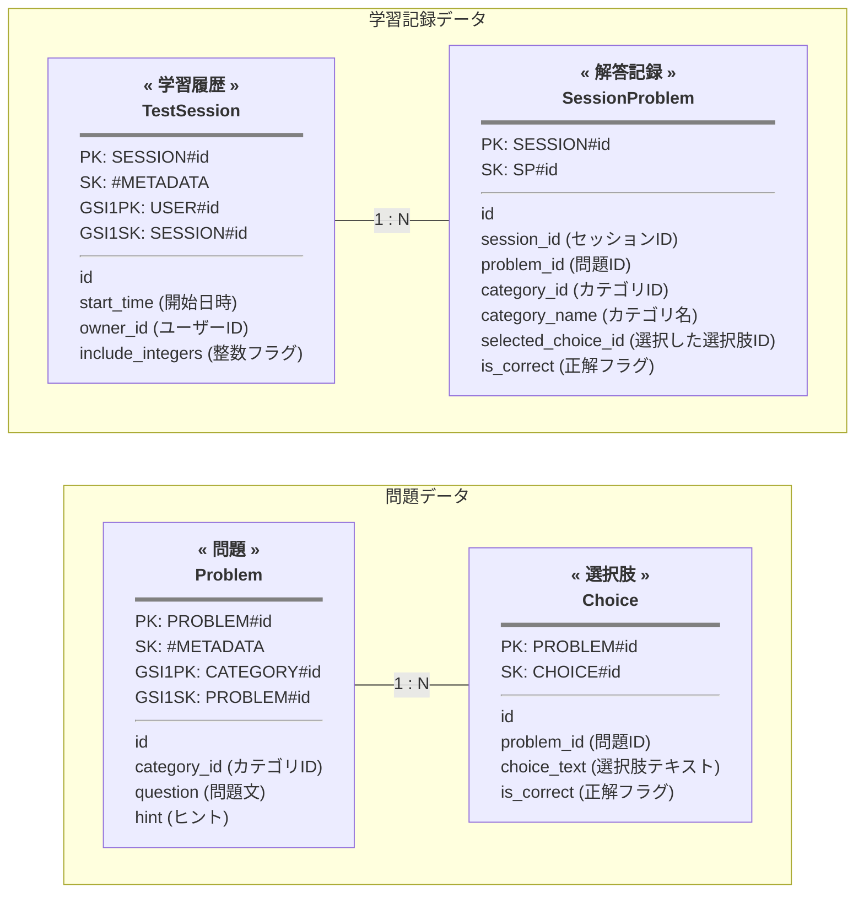

# MathOvercome_Serverless

## 概要
高校数学の苦手分野を克服するための学習支援ツールです。  
本プロジェクトは、以前制作した「Spring Boot + MySQL」構成のアプリケーションを、**「Go + AWS サーバーレス」**へとリプレースしました。  
サーバーレスによるコスト最適化と、**AIと対話を重ねる開発プロセス**を大切にしています。  
コードの実装からAWSのアーキテクチャ設計、IaC、CI/CDの構築に至るまで、AIと技術的な議論を繰り返すことで、開発速度を向上させるだけでなく、**自分自身の技術的理解と成長スピードを向上**させる取り組みに力を入れています。
> ### ℹ️ リプレース前のプロジェクトについて
> リプレース前のSpring Boot版のソースコードや、移行前のドキュメントは[こちらのリポジトリ](https://github.com/Kyouheip/MathOvercome?tab=readme-ov-file)から参照可能です。

## アーキテクチャ

本プロジェクトは、TerraformによるIaC化とGitHub Actionsを用いた自動デプロイを実現した、フルサーバーレス構成のアプリケーションです。  
スケーラビリティとコスト効率を両立した設計を行っています。

> **💡 開発の軌跡：リプレースの背景と設計の進化**  
> 旧プロジェクトからどのようにこの構成へ至ったか、思考のプロセスを [**「クラウドネイティブへの道のり」**](./docs/architecture-evolution.md) にまとめています。

### インフラ自動化とデプロイ

- **Terraform:** すべてのAWSリソースをコードで管理。環境の構築・変更を迅速に行える体制を整えています。
- **GitHub Actions:** メインブランチへのプッシュをトリガーに、以下のCI/CDパイプラインを自動実行します。
    - **変更検知:** 変更のあるディレクトリ（Frontend/Backend）のみを対象にデプロイを実施。
    - **バックエンド:** Goのユニットテスト通過後、コンテナイメージ作成、**ECRへのプッシュ**、および **Lambda関数の更新** を実行。
    - **フロントエンド:** Next.jsのビルド、**S3へのデプロイ**、および **CloudFrontのキャッシュ無効化** を実行し、最新のコンテンツを反映。

### シーケンス
ユーザーがアプリケーションを利用する際の主な処理の流れです。

1.  **フロントエンド取得:** ユーザーはブラウザから **CloudFront** 経由で、**S3** にホスティングされたNext.jsの静的コンテンツにアクセスします。
2.  **ユーザー認証:** ユーザーがログイン画面から認証情報を入力し、**Cognito** からJWTを取得します。
3.  **APIリクエスト:** フロントエンドから **API Gateway** へ、AuthorizationヘッダーにJWTを付与してリクエストを送信します。
4.  **バックエンド処理:** **API Gateway**の Cognitoオーソライザーで認証が確認されると、**Lambda (Go)** が起動します。**Lambda**は**ECR**に格納されたイメージから実行されます。
5.  **データ操作:** **Lambda**が **DynamoDB** に対してデータの読み書きを行い、処理結果をユーザーへ返却します。

## 🌐 アプリURL
[https://d3brfa55gp0etf.cloudfront.net](https://d3brfa55gp0etf.cloudfront.net)

## 主な変更点
旧プロジェクトから、サーバーレスアーキテクチャへの最適化を目的に、以下の3点を中心に設計を見直しました。

* **Lambda** 導入にあたってコールドスタート問題を考慮し Java から起動速度に優れた **Go** へ移行。  
同時に DB を MySQL からリクエスト課金型の **DynamoDB** へ変更することで、常時起動による固定費を抑え、運用コストを最小化しました。
* 独自実装のセッション管理から **Cognito** による JWT 認証へ移行し、**API Gateway** のオーソライザーで認証を行ってから Lambda へユーザー情報を引き渡す、よりマネージドでステートレスな構成を実現しました。
* 従来の動的なパスを廃止し、クエリパラメータやバックエンド主導の管理に切り替えることで、フロントエンドを **S3 + CloudFront** による静的配信（SSG）を実現。インフラ管理の手間と運用コストを最小化した設計へと刷新しました。

## 利用技術

- **バックエンド:** Go 1.24, Lambda, API Gateway, Gin 1.11, AWS SDK v2
- **データベース:** DynamoDB
- **認証:** Cognito, Amplify Auth (Library)
- **フロントエンド:** Next.js 15.3, Node.js 20, S3, CloudFront
- **インフラ / DevOps:** Terraform 1.14, GitHub Actions, ECR, Docker
- **AI ツール:** Claude Code, Gemini

## DynamoDB データモデリング

本プロジェクトでは、RDSのようにアクセスがない時間帯も発生し続ける固定コストを抑えるため、サーバーレスな**DynamoDB**を採用しました。  
効率的なデータ管理を行うためにシングルテーブル設計を用いて構築しています。  
この設計は、AIとの対話を通じて最適解を模索しながら構築したものです。現在はNoSQLモデリングの学習途上にあるため、今後の機能拡張や自身のスキル向上に合わせて、より効率的な構造へとアップデートし続けていく予定です。  
実際のテーブルがどのような構成になっているか、具体的な図とアクセスパターンでまとめています。
### 1. エンティティ構造図
データの関係性と、各エンティティが保持する属性、およびインデックスの構成図です。

---

### 2.アクセスパターン一覧
アクセスパターンとして必要となるユースケースにおいて、どのようなキーを使用してデータを取得するかを定義しています。

| ユースケース | インデックス | 検索条件 (PK / SK) |
| :--- | :--- | :--- |
| セッション情報の作成・取得 | Primary | `pk: SESSION#<id>`, `sk: #METADATA` |
| ユーザーのセッション一覧取得 | GSI1 | `gsi1pk: USER#<sub_id>` |
| セッション内の問題一覧取得 | Primary | `pk: SESSION#<id>`, `sk: begins_with(SP#)` |
| カテゴリ内の問題一覧取得 | GSI1 | `gsi1pk: CATEGORY#<id>` |
| 問題および選択肢の取得 | Primary | `pk: PROBLEM#<id>` |
| 回答の正誤判定 | Primary | `pk: PROBLEM#<id>`, `sk: CHOICE#<id>` |